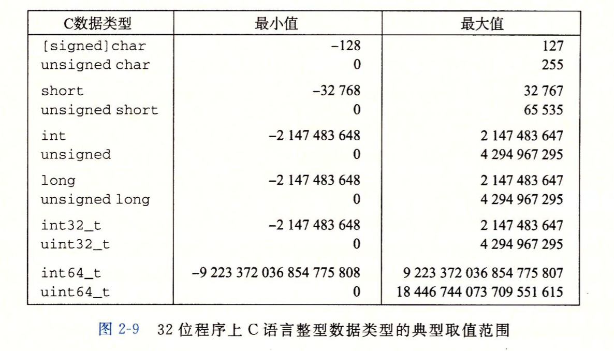
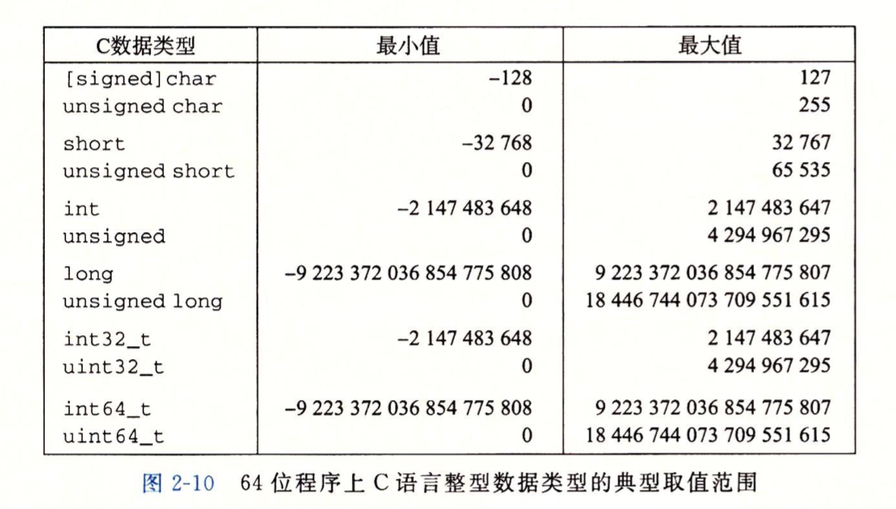
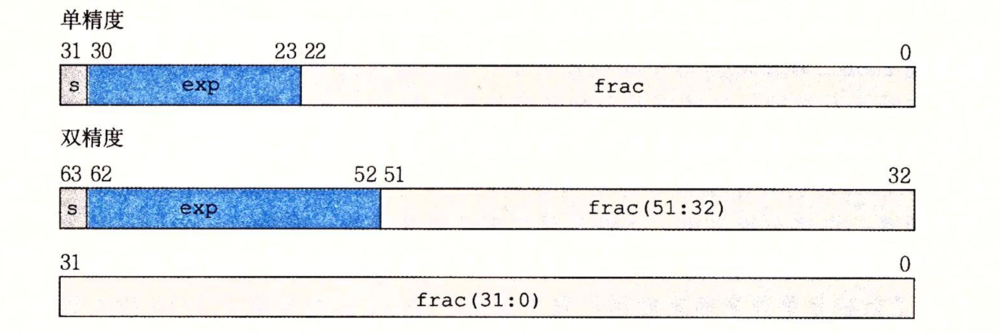
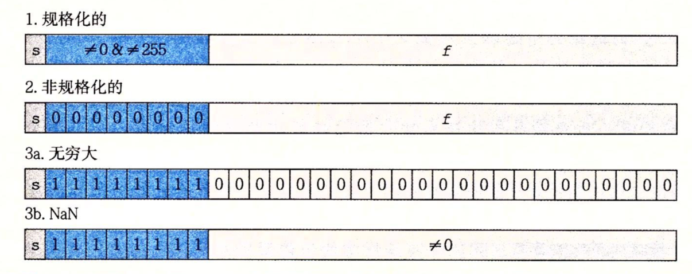
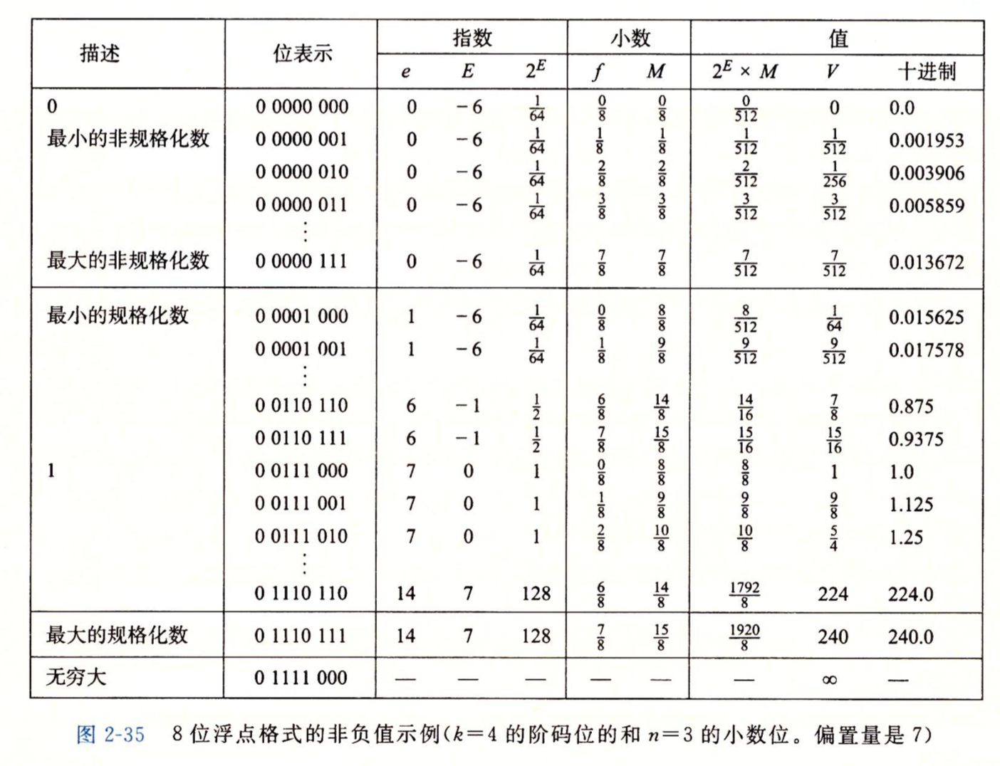
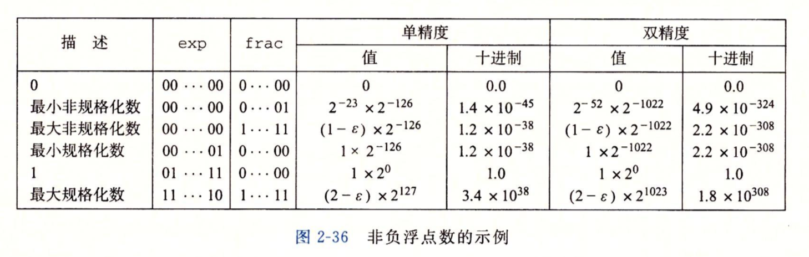
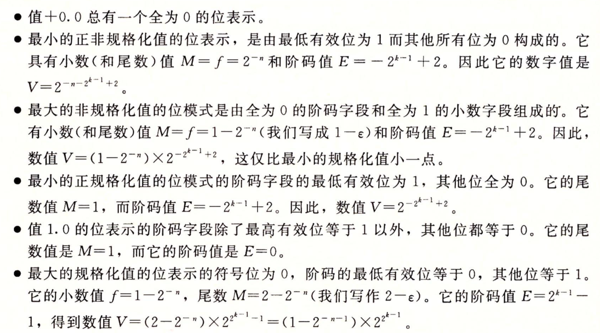
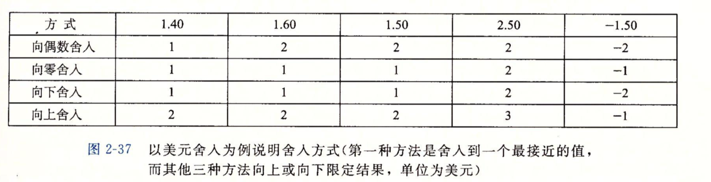

## 信息表示和处理

1. 现代计算机存储和处理信息以二进制表示。

2. 三种重要的数字表示:
   1. 无符号编码:基于传统的二进制表示法，表示>=0的数字
   2. 补码编码: 表示有符号整数的最常见的方式
   3. 浮点数编码: 是表示实数的科学计数法的以2位基数的版本

3. 计算机的表示法是用有限数量的位来对一个数字编码,因此结果溢出表示范围时，会出现异常的结果。

4. 整数和浮点数的表示区别
   1. 整数只能编码一个相对较小的数值范围，但是这种表示是精确的。
   2. 浮点数虽然可以表示一个较大的数值范围，但是这种表示是近似的

### 2.1 信息存储

1. 大多数计算机使用字节(byte)，作为最小的可寻址的内存单位，而不是访问单独的位(bit)
2. 机器级程序将内存视为一个非常大的字节数组，称为`虚拟内存 (virtual memory)`
3. 内存中的每个字节都由一个数字进行标识，即为它的`地址(address)`
4. 所有可能的地址集合，称为`虚拟地址空间(virtual address space)`
5. 每个程序对象都可以视为一个字节块，程序本身就是一个字节序列
6. C语言中一个指针(`无论它指向一个整数或是一个结构，或是一个对象等等`)的值就是某个存储块的第一个字节的虚拟地址。

####  2.1.1 十六进制表示法

1. 一个字节由8位组成，值的范围用二进制表示 00000000 ~ 11111111,用十进制表示位0~255。使用过程中，如果用二进制表示太冗长，如果用十进制表示则与二进制转换太麻烦。所以引入了16进制。
2. 十六进制：使用数字'0' ~'9'以及字符 'A' ~ 'F'(大小写都可)表示16个可能的值。
3. c语言中以0x或0X开头来标识十六进制，所以一个字节的值范围即为 0x00-0xFF。一个十六进制位由4个二进制位表示

#### 2.1.2 字数据大小

1. 字长(word size)指明指针数据的标称(nominal size)大小。

2. 字长`决定`的最重要的系统参数就是`虚拟地址空间的最大大小`

   ```
   对于一个字长为w位的机器而言，虚拟地址的范围为0~(2的w次方-1)。即程序最多访问(2的w次方)个字节
   ```

3. 32位字长的机器限制的虚拟地址空间为4GB(`2的32次方个byte`)，64位的字长的机器限制的虚拟地址空间为16EB(`1.84 * 10的19次方个字节` )

4. 32位程序和64位程序的区别

   ```
   1 区别在于该程序是如何编译的，而不是其运行的机器类型
    prog.c使用下列伪指令编译
    linux>gcc -m32 prog.c 32位程序
    linux>gcc -m64 prog.c 64位程序
   2 程序是向后兼容的，所以32位的程序可以运行到64位的机器上。但是64位的程序不能运行在32位的机器上。
    
   ```

5. c语言对各种不同数据类型，在32位和64机器上分配的字节数

   | 有符号        | 无符号         | 32位 | 64位 |
   | :------------ | :------------- | ---- | ---- |
   | [signed] char | unsigned char  | 1    | 1    |
   | short         | unsigned short | 2    | 2    |
   | int           | unsigned       | 4    | 4    |
   | long          | unsigned long  | 4    | 8    |
   | int32_t       | uint32_t       | 4    | 4    |
   | int64_t       | uinit64_t      | 8    | 8    |
   | char *        |                | 4    | 8    |
   | float         |                | 4    | 4    |
   | double        |                | 8    | 8    |

   ```
   我们可以看到有些数据类型的确切字节数依赖于程序是如何被编译的，数据类型long在32位程序中为4字节，在64位程序中为8字节。为了避免依赖"典型"大小和不同编译器设置带来的奇怪行为。在ISO C99引入了一类数据类型，其数据大小是固定的，不随编译器和机器设置而改变。其中就有int32_t,int64_t。
   ```

#### 2.1.3 寻址和字节顺序

1. 对于跨越多字节的程序对象，我们必须建立两个规则:
   + 这个对象的地址是什么
   + 在内存如何排列这些字节

2. 多字节对象都被存储为连续的字节序列，对象的地址为所使用字节中最小的地址。

   ```
   例如: int类型的变量x的地址为0x100,即为地址表达式&x的值为0x100。
   那么变量x的4个字节将被存储在0x100, 0x101, 0x102, 0x103位置
   ```

3. 排列换一个对象的字节有两个通用的规则

   1. 小端法(little endian): 最低有效字节在最前面
   2. 大端法(big endian):最高有效字节在最前面

   ```shell
   假设变量x的类型为int, 位于地址0x100处，它的十六进制值为0x01234567， 其最高字节为0x01,最低字节为0x67,其地址范围为0x100-0x103。
   
   大端法
   ...   0x100     0x101     0x102  0x103
   ...    01        23        45     67  
   
   小端法
   ...   0x100     0x101     0x102  0x103
   ...    67        45        32     01  
   
   1 大端法和小端法没有优劣之分。一个系统采用的是大端还是小端，要看厂商。一旦选择了操作系统，那么字节顺序也就固定下来了。
   2 现代有些新的微处理器是双端法，也就是可以配置作为大端或小端的机器运行
   3 Android和iOS采用的是小端法。
   ```

#### 2.1.4  表示字符串

##### 2.1.4.1 ASCII码表

+ 终端执行`$ man ascii`

```
八进制表示
     000 nul  001 soh  002 stx  003 etx  004 eot  005 enq  006 ack  007 bel
     010 bs   011 ht   012 nl   013 vt   014 np   015 cr   016 so   017 si
     020 dle  021 dc1  022 dc2  023 dc3  024 dc4  025 nak  026 syn  027 etb
     030 can  031 em   032 sub  033 esc  034 fs   035 gs   036 rs   037 us
     040 sp   041  !   042  "   043  #   044  $   045  %   046  &   047  '
     050  (   051  )   052  *   053  +   054  ,   055  -   056  .   057  /
     060  0   061  1   062  2   063  3   064  4   065  5   066  6   067  7
     070  8   071  9   072  :   073  ;   074  <   075  =   076  >   077  ?
     100  @   101  A   102  B   103  C   104  D   105  E   106  F   107  G
     110  H   111  I   112  J   113  K   114  L   115  M   116  N   117  O
     120  P   121  Q   122  R   123  S   124  T   125  U   126  V   127  W
     130  X   131  Y   132  Z   133  [   134  \   135  ]   136  ^   137  _
     140  `   141  a   142  b   143  c   144  d   145  e   146  f   147  g
     150  h   151  i   152  j   153  k   154  l   155  m   156  n   157  o
     160  p   161  q   162  r   163  s   164  t   165  u   166  v   167  w
     170  x   171  y   172  z   173  {   174  |   175  }   176  ~   177 del
     
十六进制表示

     00 nul   01 soh   02 stx   03 etx   04 eot   05 enq   06 ack   07 bel
     08 bs    09 ht    0a nl    0b vt    0c np    0d cr    0e so    0f si
     10 dle   11 dc1   12 dc2   13 dc3   14 dc4   15 nak   16 syn   17 etb
     18 can   19 em    1a sub   1b esc   1c fs    1d gs    1e rs    1f us
     20 sp    21  !    22  "    23  #    24  $    25  %    26  &    27  '
     28  (    29  )    2a  *    2b  +    2c  ,    2d  -    2e  .    2f  /
     30  0    31  1    32  2    33  3    34  4    35  5    36  6    37  7
     38  8    39  9    3a  :    3b  ;    3c  <    3d  =    3e  >    3f  ?
     40  @    41  A    42  B    43  C    44  D    45  E    46  F    47  G
     48  H    49  I    4a  J    4b  K    4c  L    4d  M    4e  N    4f  O
     50  P    51  Q    52  R    53  S    54  T    55  U    56  V    57  W
     58  X    59  Y    5a  Z    5b  [    5c  \    5d  ]    5e  ^    5f  _
     60  `    61  a    62  b    63  c    64  d    65  e    66  f    67  g
     68  h    69  i    6a  j    6b  k    6c  l    6d  m    6e  n    6f  o
     70  p    71  q    72  r    73  s    74  t    75  u    76  v    77  w
     78  x    79  y    7a  z    7b  {    7c  |    7d  }    7e  ~    7f del
     
     
十进制表示
      0 nul    1 soh    2 stx    3 etx    4 eot    5 enq    6 ack    7 bel
       8 bs     9 ht    10 nl    11 vt    12 np    13 cr    14 so    15 si
      16 dle   17 dc1   18 dc2   19 dc3   20 dc4   21 nak   22 syn   23 etb
      24 can   25 em    26 sub   27 esc   28 fs    29 gs    30 rs    31 us
      32 sp    33  !    34  "    35  #    36  $    37  %    38  &    39  '
      40  (    41  )    42  *    43  +    44  ,    45  -    46  .    47  /
      48  0    49  1    50  2    51  3    52  4    53  5    54  6    55  7
      56  8    57  9    58  :    59  ;    60  <    61  =    62  >    63  ?
      64  @    65  A    66  B    67  C    68  D    69  E    70  F    71  G
      72  H    73  I    74  J    75  K    76  L    77  M    78  N    79  O
      80  P    81  Q    82  R    83  S    84  T    85  U    86  V    87  W
      88  X    89  Y    90  Z    91  [    92  \    93  ]    94  ^    95  _
      96  `    97  a    98  b    99  c   100  d   101  e   102  f   103  g
     104  h   105  i   106  j   107  k   108  l   109  m   110  n   111  o
     112  p   113  q   114  r   115  s   116  t   117  u   118  v   119  w
     120  x   121  y   122  z   123  {   124  |   125  }   126  ~   127 del
```

##### 2.1.4.2  字符串

1. c语言中字符串被编码为一个以null(其值为0)字符结尾的字符数组。每个字符都以某个标准编码来表示。最常见的就是ASCII字符码。

   ```
   对字符串 "12345", 参照ASCII码表，其十六进制字节码为  31 32 33 34 35 00。
   ```

2. 在使用ASCII字符码的任何系统上都将得到相同的结果，与字节顺序和字大小规则无关。因此，文本数据比二进制数据具有更强的平台独立性。

   >文字编码的Unicode标准
   >
   >1  ASCII字符集适合编码英语文档，无法表示特殊字符，如中文，俄文等语言。
   >
   >2 Unicode统一字符集，使用32位来表示字符。这好像是要求每个字符要占用4个字节。
   >
   >3 不过，常见的字符只需要1个或2个字节，而不太常用的字符需要多一些字节数。
   >
   >4 UTF-8将每个字符编码为一个字符序列，其包含ASCII编码。
   >
   >5 Java使用Unicode来表示字符串。对于C语言也有支持Unicode的程序库。

#### 2.1.5 表示代码

下面的c函数

```
int sum(int x, int y) {
    return x + y;
}
```

当在不同机器上编译时，生成如下字节表示的机器代码;

```
Linux32 55 89 e5 8b 45 0c 03 45 08 c9 c3 
Windows 55 89 e5 8b 45 0c 03 45 08 5d c3 
Sun     81 c3 e0 08 90 02 00 09
Linux64 55 48 89 e5 89 7d fc 89 75 f8 03 45 fc c9 c3 
```

1. 我们发现指令编码是不同的，不同机器类型使用不同的且不兼容的指令和编码方式。

2. 即使完全一样的进程，运行在不同的操作系统上也会有不同的编码规则，因此二进制代码是不兼容的。
3. 二进制代码很少能够在不同机器和操作系统组合之间进行移植。

#### 2.1.6 布尔代数简介

简而言之，就是使用 `&(与)`,` |(或)`,` ~(非)`,` ^(异或)`进行位运算

```
位向量 [0110] 和 [1100]进行位运算
  
  0110    0110   0110    
& 1100  | 1100 ^ 1100  ~ 1100
  ----    ----   ----    ----
  0100    1110   1010    0011
  
1 运算规则
 & 同真为真
 | 一真为真
 & 不同为真
 ~ 按位取反
2 对于任何值与自己本身异或，值为0
  x ^ x = 0
3 利用^来交换x和y的值   
   x = x ^ y  
   y = x ^ y   ===> (y = x ^ y ^ y) ====> (y = x )
   x = x ^ y   ===> (x = x ^ y ^ x) ====> (x = y )
```


#### 2.1.7 C语言中的位级运算

| C的表达式  | 二进制表达式             | 二进制结果  | 十六进制表达式 |
| ---------- | ------------------------ | ----------- | -------------- |
| ~0x41      | ~[0100 0001]             | [1011 1110] | 0xBE           |
| ~0x00      | ~[0000 0000]             | [1111 1111] | 0xFF           |
| 0x69&0x55  | [0110 1001]&[0101 0101]  | [0100 0001] | 0x41           |
| 0x69\|0x55 | [0110 1001]\|[0101 0101] | [0111 1101] | 0x7D           |

1. 正如上表所示，进行位运算时，将其他进制转换成二进制，然后进行位运算后，再转回所需的进制。

2. 位级运算的一个常见用法是实现掩码运算。这里的掩码是一个位模式，表示**从一个字中**`选出的`位的集合。

   ```
   1. 对于一个字长为32位的机器,掩码0xFF表示一个字的最低字节。
   2. 对于x = 0x89ABCDEF, x&0xFF = 0x000000EF, 只会保留x的最低字节，其他字节均为0。
   3. ~0将会生成一个全为1的掩码，不管机器的字大小是多少。
   4. 尽管对于32位的机器来说，掩码可以写为0xFFFFFFFF,但是这样的代码不是可移植的。
   
   ```

#### 2.1.8 C语言中的逻辑运算

1. 逻辑运算符: `||`, `&&`,` !`。

2. 逻辑运算中认为所有非0的参数都表示true,参数0表示false。

   | 表达式       | 结果 |
   | ------------ | ---- |
   | !0x41        | 0x00 |
   | !0x00        | 0x01 |
   | !!0x41       | 0x01 |
   | 0x69&&0x55   | 0x01 |
   | 0x69\|\|0x55 | 0x01 |

3. 具有`短路机制`,如果第一个表达式的结果已经能够确认整个表达式的值，那么第二个表达式就不会进行运算。

#### 2.1.9 C语言中的移位运算

1. 左移:对于操作数x， 向左移动k位，将丢弃最高的k位，并在右端补k个0

   ```
   操作数x: 0101 1001    
       (01)0110 0100  向左移动2位,最高的2位被丢弃，右端补2个0
       
   //无符号数和有符号数都用左移
   ```

2. 右移: 逻辑右移和算术右移

   ```
   逻辑右移:向右移动k位，低位丢弃，高位补0
   算术右移:向右移动k位，低位丢弃，高位补最高有效位的值
   
   算术右移:用于操作有符号数
   逻辑右移:用于操作无符号数
   ```

3. 移位示例

   | 操作              | 值                          |
   | ----------------- | --------------------------- |
   | 参数x             | (0110  0011)    (1001 0101) |
   | x <<  4           | (0011  0000)    (0101 0000) |
   | x >>  4  逻辑右移 | (0000  0110)    (0000 1001) |
   | x >>  4  算术右移 | (0000  0110)    (1111 1001) |

4. C语言虽然没有规定对于有符号数应该运用哪种形式的右移。但是，实际上，几乎所有的编译器/机器组合都对有符号数使用算术右移，且程序员也是假设机器对有符号数使用算术右移。

5. 对于无符号数，右移必须是逻辑的。

6. Java对右移有明确的定义。

   * `x >> k` , 会将x做算术右移
   * `x>>>k`，会对x做逻辑右移

7. 一个数w位，当移动的位数k大于等于w时，该如何处理?

   ```
   实际移动的位数是 =  k % w;
   
   int lval = 0xFEDCBA98   << 32   w=32 k = 32  向左位移0位 =====》0xFEDCBA98
   int aval = 0xFEDCBA98   >> 36   w=32 k = 36  向右位移4位 =====》0xFFEDCBA9
   int uval = 0xFEDCBA98u  >> 40   w=32 k = 40  向右位移8位 =====》0xFFFEDCBAu
   ```

### 2.2 整数表示

1. 用位来编码整数的两种不同的方式: 一种只能表示非负数。另一种能够表示正数，零，负数。


#### 2.2.1 整型数据类型

1. 32位程序上, C语言整型数据类型的典型取值范围

   

2. 64位程序上, C语言整型数据类型的典型取值范围

   

3. C语言标准定义了美中数据类型必须能够表示的最小的取值范围

   

#### 2.2.2 无符号的编码

对于一个w位的无符号编码，其值的范围为0 ~ (2的w次方 - 1)

#### 2.2.3 补码编码

1. 补码是最常见的表示有符号数的形式。其最高位为符号位。它的权重为`-2[w-1](即为-2的w-1次方)`

   ```
   由下列补码求其值
   0001 = - 0 * 2[3] + 0 * 2[2] + 0 * 2[1] + 1 * 2[0] =  0 + 0 + 0 + 1 =  1
   0101 = - 0 * 2[3] + 1 * 2[2] + 0 * 2[1] + 1 * 2[0] =  0 + 4 + 0 + 1 =  5
   1011 = - 1 * 2[3] + 0 * 2[2] + 1 * 2[1] + 1 * 2[0] = -8 + 0 + 2 + 1 = -5
   1111 = - 1 * 2[3] + 1 * 2[2] + 1 * 2[1] + 1 * 2[0] = -8 + 4 + 2 + 1 = -1
   ```

2. 从上面的计算中可以得到w位的补码所能表示的值的范围

   ```
   其最小值为 [10....0](w) = -2[w-1]
   其最大值为 [01....1](w) = 2[w-1] - 1 
   
   例如8位有符号数
   其最小值为 -2[8-1]  = -2[7] = -128
   其最大值为 2[8-1]-1 = 2[7] -1 = 127
   ```

3. C语言标准没有要求用补码表示有符号数，但几乎所有机器都是这样做的。

4. 如上面图所示C语言标准只定义了最小的值范围，在不同机器上值并不完全相同，若要具备可移植性，最好使用initN_t, uintN_t等整型变量

5. java非常明确的要求用补码表示有符号数。并且其取值范围是64位的。java中单字节数据是byte,而不是char。这些非常具体的要求，保证了java无论运行在什么机器上，其行为的是一致的。

6. 有符号数的其他表示

   ```
   1 反码: 除了最高有效位的权是 -(2[w-1]-1)，其他的都和补码一样。
   2 原码: 最高有效位是符号位，用来确定剩下的位应该取负还是正
   3 这两个都有一个奇怪的属性。那就是对于数字0都有两种不同的编码方式
   反码中 [00...0]解释为+0, [11...1]解释为-0
   原码中 [00...0]解释为+0, [10...0]解释为-0
   ```

7. 原码，反码，补码的相互转化

   ```
   正数的原码，反码，补码都一样。
   负数的反码: 符号位不变，其他位按位取反[从原码求反码]
   负数的补码: 反码+1
   
   特殊:负数补码表示的最小值，没有对应的反码和补码
   ```

8. 补码运算示例

   ```c
   short x = 12345;
   short mt = -x;
   show_bytes((byte_pointer)&x,sizeof(short));
   show_bytes((byte_pointer)&mx,sizeof(short));
   void show_bytes(byte_pointer start, size_t len) {
       size_t i;
       for (i = 0; i < len; i++) {
           printf("%.2x", start[i]);
       }
   }
   
   大端法机器运行时，这段代码的输出位30 39 和cf c7,指明x的十六进制为0x3039, 而mx的十六进制表示为0xCFC7。
   
    12345其补码为[0011 0000 0011 1001] -> 0x3039
   -12345其补码为[1100 1111 1100 0111] -> 0xCFC7
       
   怎么求-12345的补码?
       1 先求原码, 原码等于12345的原码，符号位改为1
       2 再求反码
       3 在求补码
   ```


#### 2.2.4 有符号数和无符号数之间的转换

将一个数进行强制转换其二进制不变，只是解释该二进制的方式改变了。

```c
#include <stdio.h>
int main()
{
   short int v = -12345;
   unsigned short uv = (unsigned short)v;
   printf("%d, uv=%u\n", v,uv);
   return 0;
}

$ gcc -o test test.c
$ ./test
$ -12345, uv=53191
    
在一台使用补码的机器上，上述代码会产生如下输出:
v = -12345, uv = 53191
-12345的补码是 [1100 1111 1100 0111]
将该补码，按照无符号位进行解释，值为53191
```

#### 2.2.5 C语言中的有符号数与无符号数

1. 声明12345或0x1A2B这样的常量，被被人是有符号数。

2. 声明无符号常量，其后面加u或U。

3. printf时，可使用%d, %u,%x，以有符号十进制，无符号十进制，和十六进制来输出一个数字。

   ```
   int x = -1;
   unsigned u = 2147483648;
   printf(x = %u, x = %d\n, x, x)
   printf(u = %u, u = %d\n, u, u)
   
   当在32位机器上运行时，输出如下:
   x = 4294967295, x = -1
   u = 214748x3648, u = -2147483648
   
   无符号数:214748x3648的补码，是int数-2147483648的补码
   ```

4. C语言当执行一个运算时，如果它的一个运算数是有符号的而另一个是无符号的，那么会把有符号的数隐式转成无符号的。

   ```
   1. 进行算术运算时，结果并没有什么影响。因为它执行的是位运算。
   2. 进行比较运算时，结果可能出现异常。
   
   -1<0 是正确的
   -1<0u是错误的,因为-1会被转成无符号数，表达式会变成 2147483647u < 0u
   ```

#### 2.2.6 扩展一个数字的位表示

1. 运算时,一个整数在不同字长间进行转换，如何保持值不变。一般是将一个较小的数据类型转换成较大的数据类型。反之，很可能不准确。

2. 无符号数的零扩展:只需要将无符号数的二进制位前补0即可

3. 有符号数的符号扩展: 只需将有符号数的二进制前补符号位即可 

   ```c
   short sx = -12345;
   usigned short usx = sx;
   int x = sx;
   unsigned ux = usx;
   printf("sx = %d:\t", sx);
   show_bytes((byte_pointer)&x,sizeof(short));
   
   printf("usx = %u:\t", usx);
   show_bytes((byte_pointer)&x,sizeof(unsigned short));
   
   printf("x = %d:\t", x);
   show_bytes((byte_pointer)&x,sizeof(int));
   
   printf("ux = %u:\t", ux);
   show_bytes((byte_pointer)&ux,sizeof(unsigned));
   
   //采用补码的32位大端法机器上运行这段代码，结果如下
   
   sx = -12345: cf c7
   usx = 53191: cf c7
   x = -12345: ff ff cf c7
   ux = 53191: 00 00 cf c7
   
   16位字长时，-12345和53191的补码是相同的=> cf c7
   
   32位字长时, 根据符号位扩展原则。
   -12345的补码前补16个是符号位1 => ff ff cf c7
   53191的补码前补16个0  => 00 00 cf c7 
   ```

4. 符号位扩展的原理解释

   ```
   1 当符号数>=0时，补码前面补0，不影响值，这一点很容易理解。
   2 当符号数<0是，补码前面补1，为什么值还不变呢?
   
   下面约定: ()内的值是下标 []值是上标
   
   假设负数值x为w位，其二进制表示为[1,x(w-2)...x(1),x(0)]。
   将其扩展k位。二进制表示为[1,1,...1, 1,x(w-2)...x(1),x(0)]。
   
   扩展前 x =  -2[w-1] * 1 +  2[w-2] * x(w-2) + ...+ 2[0] * x(0)
   扩展后 x = -2[w+k-1] * 1 + -2[w+k-2] * 1 + ... + 2[w-1] * 1 +  2[w-2] * x(w-2) + ...+ 2[0] * x(0)
   
   由下面的推导可知，扩展前后其权重相当于不变，所以x的值也没改变。
   -2[w+k-1] * 1 + -2[w+k-2] * 1 + ... + 2[w-1] * 1 
   = -2[w-1](-2[k] + 2[k-1] + ...+2[0])
   = -2[w-1](-2[k]+ 2[k] -1)
   = -2[w-1]
   ```

#### 2.2.7 截断数字

1. 无符号数:将一个w位的无符号数截断为的k位的无符号数，丢弃高位w-k即可。

   ```c
   unsigned short a = 32773;
   unsigned char b = a;
   printf("%d \n", b);
   
   //结果为5
   a作为unsigned short是2个字节: 1000 0000 0000 0101           => 32773
   b作为unsigned char 是1个字节:           0000 0101(被截断高位) => 5
   ```

2. 有符号数:将一个w位的无符号数截断为的k位的无符号数，丢弃高位w-k即可。然后截断后的最高位当做符号位。

   ```c
    int x = 53191;
    short sx = (short)x;
    int y = sx;
   
    printf("sx = %d \n", sx);
    printf("y = %d \n", y);
   //结果
   sx = -12345
   y = -12345
       
    x: 0000 0000 0000 0000 1100 1111 1100 0111             =>  53191
   sx:                     1100 1111 1100 0111 (截断16位高位)=> -12345
    y: 1111 1111 1111 1111 1100 1111 1100 0111 (按有符号扩展规则，前面补符号位1,值不变) =>-12345
   ```

#### 2.2.8 关于有符号数和无符号数的建议

1. 尽量避免有符号数和无符号数的相互转化，这可能会造成异常的结果

   ```c
   size_t stren(const char *s);  
   [size_t在c中定义为 32位机器上 usigned int , 64位机器上 usigned long]
   
   int strlonger(char *s, char *t) {
       return strlen(s) - strlen(t) > 0;
   }
   
   int c = strlonger("aaa", "bbbc");
   printf("%d \n", c); 
   //打印结果为1; 错误
   
   //进行分析
   1. 无符号数3与-4进行运算，会把-4当做无符号数
   2. 0000 0000 0000 0000 0000 0000 0000 0011   3
      1111 1111 1111 1111 1111 1111 1111 1100  -4
      1111 1111 1111 1111 1111 1111 1111 1111  4294967295 [无符号数]
   3. 4294967295>0所以值为1
       
   如何进行修改?
   int strlonger(char *s, char *t) {
       int strlonger(char *s, char *t) {
       return (int)(strlen(s) - strlen(t)) > 0;
   }
       
   1111 1111 1111 1111 1111 1111 1111 1111(补)作为有符号数时=> -1
   1111 1111 1111 1111 1111 1111 1111 1110(反)
   1000 0000 0000 0000 0000 0000 0000 0001(原)
   ```

### 2.3 整数运算

#### 2.3.1 无符号加法 

1. 对于w位无符号数的加法运算，存在是否溢出的问题。

   ```
   w位的无符号数 的取值范围为 0<=x,y<=2[w]-1, 0<=x+y<=2[w+1]-2,其结果需要w+1才能表示。
   
   当结果被截断为w位时，其结果值计算如下:
   若x+y < 2[w]，结果为x+y,没有溢出
   若x+y >= 2[w]，结果为为x+y-2[w]，溢出
   ```

2. 无符号加法溢出的判断

   ```
   当x+y的结果s小于x，y之中的最小值时，则表明溢出
   
   原理: 溢出时s = x+y = x+y-2[w]
   因为 y<2[w] => y-2[w]<0 => s<x
   ```

3. 无符号数求反，即为无符号数的逆元

   ```
   0<=x<2[w]的，其w位的无符号逆元
   
   若x=0,则无符号逆元为0
   若x>0&x<2[w],则无符号逆元为2[w]-x
   ```

#### 2.3.2 补码加法

1. 对于w位的有符号数的加法运算，同样存在是否溢出的问题

   ```
   w位的有符号数 -2[w-1]<=x, y<=2[w-1]-1, 其和 -2[w]<=x+y<=2[w]-2,其结果需要w+1才能表示。
   
   当结果被截断为w位时，其结果值计算如下:
   当x+y>=2[w-1]时,结果为x+y-2[w], 正溢出
   当 -2[w-1]<=x+y<=2[w-1]-1时, 结果为x+y,没有溢出
   当 x+y<-2[w-1]时,结果为x+y+2[w],负溢出
   ```

2. 补码加法溢出的判断

   ```
   当前仅当 x > 0, y >0, 但结果s<=0,则s发生了正溢出
   当前仅当 x < 0, y <0, 但结果s>=0,则s发生了负溢出
   ```

#### 2.3.3 补码的非

1 补码

#### 2.3.4 无符号乘法

1. 范围在 0<= x, y <= $2^w$ -1内的整数x和y可以被表示为w位的无符号数，它们乘积的范围是0到($2^w$ -1)($2^w$ -1) =$2^2$$^w$ -$2^w$$^+$$^1$+1之间。这需要2w位来表示。
2. 但是在c语言中无符号乘法被定义为产生w为的值，所以也即是2w为的整数成绩的低w位来表示结果。x * y = x * y mod 2 [w]。(`mod 取模/余`)

#### 2.3.5 补码乘法

1. 与无符号乘法规则相同

2. 无符号乘法和补码乘法（以w等于3进行演示)

   ```c
    模式       x        y           x*y      截断的x*y
   无符号   5 [101]  3  [011]   15 [001111]   7 [111]
   补码    -3 [101]  3  [011]  -9  [110111]  -1 [111]
   
   无符号   4 [100]  7  [111]   28 [011100]   4 [100]
   补码    -4 [100] -1  [111]   4  [000100]  -4 [100]
   
   无符号   5 [011]  3  [011]   9  [001001]   1 [001]
   补码    -3 [011]  3  [011]   9  [001001]   1 [001]
   
   由上图可知，无符号和有符号相同位运算后，其结果的截断的位也是相同的。
   ```

#### 2.3.6  乘以常数

1. 以往，在大多数机器上，乘法指令相当慢，需要10个或者更多的时钟周期。
2. 然而其他整数运算(例如，加法,减法，位级运算和移位)只需要1个时钟周期。
3. 因此，编译器使用了一项重要的优化，用移位和加法运算的组合来代替乘以常用因子的乘法。

4. 举例子说明

   ```
   对于任意的常数都可以拆解成若干个2的幂次方与常量的和的形式
   
   例如15 = 2[3] + 2[2] + 2[1] + 1
   表达式 x * 15 = x * 2[3] + x * 2[2] + x * 2[1] + x
                = (x << 3) + (x << 2) + (x << 1) + x  
   //从上面可以知道 x * 15 就被拆解成 x左移3位 ，x左移2位 ，x左移1位 ，x之和
   
   //从2.3.4和2.3.5可知，无论是无符号乘法还是补码乘法，如果溢出，其溢出后的截断位是相同的。乘以常数，同样如此。
   ```

#### 2.3.7 除以2的幂

1. 在大多数机器上，整数除法要比整数乘法更慢—需要30个或者更多的时钟周期。

2. 除以2的幂可以用右移位运算来实现，无符号分别使用逻辑移位和算术移位来达到目的。

3. 整数除法总是`舍入到0`。(即向靠近0的方向舍弃小数，从而取整)

   ```
    也就是说对于结果为正数的，将向下舍入  3.14 -> 3
    也就是说对于结果为负数的，将向上舍入 -3.14-> -3
   ```

4. 除以2的幂的无符号除法，恰好相当于执行向右执行逻辑位移，向下舍入(舍入到0)。

   ```c
   对于无符号值12340，除以2的k次幂
                                      [右移结果]
   k              >>k(二进制)          十进制    12340/2[k]
   
   0          0011 0000 0011 0100     12340     1234.0
   1          0001 1000 0001 1010     6170      6170.0
   4          0000 0011 0000 0011     771       771.25
   8          0000 0000 0011 0000     48        48.203125
   ```

5. 除以2的幂的补码除法，若x为负时，`如果仅仅`是按算术右移,那么结果是，向下舍入(非舍入到0)

   ```c
   对于无符号值-12340，除以2的k次幂
                                     [右移结果]
   k              >>k(二进制)          十进制    12340/2[k]
   
   0          1100 1111 1100 1100    -12340     -1234.0
   1          1110 0111 1110 0110    -6170      -6170.0
   4          1111 1100 1111 1100    -772       -771.25
   8          1111 1111 1100 1111    -49        -48.203125
   ```

6. 除以2的幂的补码除法，若x为负时，`实际上`在移位之前对值进行了`偏置`，来修正这种不合适的舍入，从而达到向上舍入(舍入到0)

   ```c
   对于无符号值-12340，增加偏量(2[k]-1)后，再除以2的k次幂。
                                                              [偏置后右移结果]
   k   偏量   -12340 + 偏量                   >>k(二进制)          十进制    12340/2[k]
   
   0   0     1100 1111 1100 1100         1100 1111 1100 1100    -12340    -1234.0
   1   1     1100 1111 1100 1101         1110 0111 1110 0110    -6170     -6170.0
   4   15    1100 1111 1101 1011         1111 1100 1111 1101    -771      -771.25
   8   255   1101 0000 1100 1011         1111 1111 1101 0000    -48       -48.203125
   ```

7. 综上, 除以2的幂的补码除法, 使用算术右移的表达式

   ```
   (x<0 ? x+ (1<<k) -1 : x) >> k   
   
   如果x >0, 那么就将x执行算术右移，向右移动k位
   如果x < 0, 那么先将x 加上偏量 2[k]-1,然后再执行算术右移，向右移动k位
   
   1<<k即为将1向左移动k位 ==> 2的k次方
   ```

###  2.4 浮点数

大约在1985年, IEEE(电气与电子工程师协会-- Institute of Electrical and Electronic Engineers)推出了754标准，这是一个仔细定制的表示浮点数及其运算的标准。

#### 2.4.1 二进制小数

1. 十进制的小数表示

   ```
   d(m)d(m-1)…d(1)d(0).d(-1)d(-2)…d(-n)
   等价于 d(m)*10[m] + d(m-1)*10[m-1] + d(1)*10[1] + d(0)*10[0] + d(-1)*10[-1] + d(-2)*10[-2] + d(-n)*10[-n]
   
   举例：十进制数12.34
   1*10[1]+2*10[0]+3*10[-1]+4*10[-2] = 10 + 2 + 3/10 + 4/100 = 12 + 34/100
   ```

2. 由上面可以推算出二进制形式的小数表示

   ```
   b(m)b(m-1)…b(1)b(0).b(-1)b(-2)…b(-n)
   等价于 b(m)*2[m] + b(m-1)*2[m-1] + b(1)*2[1] + b(0)*2[0] + b(-1)*2[-1] + b(-2)*2[-2] + b(-n)*2[-n]
   
   举例：二进制数101.11
   1*2[2] + 0*2[1] + 1*2[0] + 1*2[-1] + 1*2[-2]
   = 4 + 0 + 1 + 1/2 + 1/4 = 4 + 3/4
   ```

3. 二进制小数，小数点向左移动1位，相当于该数除以2，小数点向右移动1位，相当于该数乘以2。

4. 形如 0.11111111111..的数表示刚好小于1的二进制小数。我们用`1.0 - ε`来表示这个值。`ε`表示一个无穷小的小数

   ```
   0.11111111111.. = 2[-1] + 2[-2] + ... + 2[-n] = (2[n-1] + 2[n-2] + ... + 2[-n])/2[n]
                                                 = (2[n] -1)/2[n]
                                                 = 1 - 1/2[n]
                                                 
   所以，n越大，值越接近于1                                              
   ```

5. 正如十进制不能准确的表示像 1/3, 5/7这样的小数。二进制小数也不能精确的表示所有的小数。根据上面二进制小数的表达式，我们可以得知，其只能在表示在限定位中`能够写成 x*2[y]`的小数。

6. 对于不能精确的表示的小数, 我们只能进行近似表示，增加二进制的位数能够提高表示的精度。

7. 一些二进制小数表示练习

   | 表示(二进制) | 值     | 十进制     |
   | ------------ | ------ | ---------- |
   | 0.0          | 0/2    | 0.0        |
   | 0.01         | 1/4    | 0.25       |
   | 0.0011       | 3/16   | 0.1875     |
   | 0.001101     | 13/64  | 0.203125   |
   | 0.00110011   | 51/256 | 0.19921975 |

#### 2.4.2 IEEE754 浮点表示

1. IEEE浮点标准用 `V=(-1)[s]*M*2[E]`的形式表示一个浮点数
   1. 符号[sign]: s=1表示负数， s=0表示负数。对于数值0.0的浮点数的符号位特殊处理。
   2. 尾数[significand]: M是一个二进制小数，它的抚慰是1 ~ 2-ε 或 0 ~ 1-ε
   3. 阶码[expoent]: E的作用是对浮点数进行加权
2. 一个浮点数的位被划分为3个字段:
   1. 1个单独的符号位s。
   2. k位的阶码字段 exp = e(k-1)...e(1)e(0) 用来编码E
   3. n位的小数字段 frac = f(n-1)...f(1)f(0) 用来编码M


3. c语言中，单精度(float)浮点数为32位表示,其中s,exp和frac字段分别为1位，k=8位和n = 23位。

   双精度(double)浮点数为64位表示,其中s,exp和frac字段分别为1位，k=11位和n = 52位。

   

4. 单精度浮点数的编码值的三种不同情况。

   

   + **情况1：规格化的值**

     1. exp的位模式既不全为0，也不全为1。
     2. 阶码字段E被解释为`以偏置(biased)形式表示`的有符号整数。
     3. 阶码E表示为 `E = e - Bias`。
        * e是无符号数，其位表示为e(k-1)...e(1)e(0) ,对于单精度其值范围为 1~254,双精度值范围为1~2046
        *  Bias=2[k-1] -1 (单精度 2的7次方 -1 = 127, 双精度为2的10次方-1 = 1023)。
        * 单精度时E的范围为-126~127。双精度时E的范围为 -1022 ~ 1023
     4.  frac字段为小数字段，鉴于一个二进制小数可以化为1.x*2^E的形式，可以将1.x中的1省略不表示，反正每一个数最终都包含1，这就叫做共识。因为省略了1，因此在最终计算结果的时候需要加1，尾数定义为M=1+f，f的二进制表示为0.f(n-1) ... f(1) f(0)

   + **情况2: 非规格化的值**

     1. 阶码全为0, E = 1 - Bias，单精度时，E= 1- 127 = -126,双精度时E = 1-1023 = -1022。定义尾数M = f。

     2. 非规格化有两个用途

        + 表示数值0

          ```
          当使用规格化的值时M>=1, 因此只能无线接近于0,但不能表示0。
          
          当符号位0，阶码为0，小数位也全为0时，表示+0
          当符号位1，阶码为0，小数位也全为0时，表示-0
          
          +0和-0，在某些方面认为是不同的，但是某些方面认为是相同的。
          ```

        + 表示非常接近0的数。

          ```
          因为阶码E为-126或-1022，所以其值为非常接近0的数。
          ```

   + **情况3: 特殊值**

     1. 阶码全为1.

     2. 当小数域全为0时，表示无穷。s = 0时表示 `正无穷`,s = 1时表示`负无穷`。

        ```
        用于表示非常大的两个数相乘，或者除以0，无穷用以表示`溢出的结果`
        ```

     3. 当小数域非0时，值为NaN (Not a Number)。

        ```
        例如对 -1进行开方，无穷-无穷等。
        ```


#### 2.4.3 数字示例

1. 下面假定8位浮点格式的示例，其中阶码位k=4，小数位n=3。

   

   + 非规格化数范围:E= 1-7 = -6， 2^E= 1/64。小数f的范围为0,1/8,...7/8。从而V的范围是0~7/512
   + 规格化数的范围: 8/512~240
   + 观察到最大非规格化数为7/512,最小规格数为8/512,这种平滑的转换取决于我们将非规格数的E定义为1-Bias。
   + 当超出最大规格数之后就溢出了，变成无穷大。

   ​      

2. 单精度和双精度的非负取值范围

   

   

3. 把12345转换成浮点数表示。

   ```
   1. 将12345的二进制位左移13位得到规格化表示
      12345= [11 0000 0011 1001] = 1.1000000111001 * 2[13]
   2. 用IEEE单精度编码，小数位丢弃开头1，末尾增加10个0，构造小数字段表示
      [10000001110010000000000]
   3. 用13加上偏置量127得到140，构造阶码字段表示
      [10001100]
   4. 再加上符号位0，则12345的单精度浮点数形式的二进制表示为
      [0 10001100 10000001110010000000000]
   5. 由上面第2步可知整数值12345和小数值12345.0的小数位的高位匹配
   0000000000000000001`1000000111001`
             010001100`1000000111001`0000000000
   ```

#### 2.4.4 舍入

1. 因为表示方法限制了浮点数的范围和精度，所以浮点运算只能近似的表示实数运算。

2. 对于值x找到最近金的期望值，这就是舍入运算的任务。 x[-]<=x<=x[+]

3. 下图四种舍入运算示例, 默认是向偶数舍入

   


#### 2.4.5 int,float,double之间的转换原则

1. 从int转换成float，数字不会溢出，但是可能被舍入。

2. 从int或float转换成double,因为double有更大的范围，也有更高的精度，所以能够保留精确的数值。

3. 从double转换成float，因为范围要小一些，所以值可能溢出成`正无穷`或`负无穷`。另外，因为精确度小，它还可能被舍入。

4. 从float或者double转换成int。值将会向零舍入。例如1.999将被转换成1。-1.999将被转换成-1。值也可能溢出。
