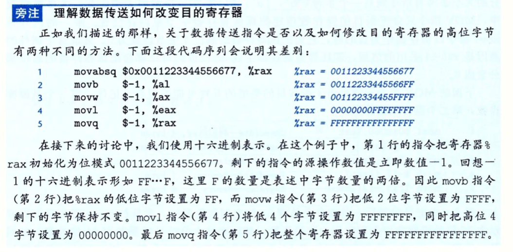

## 程序的机器级表示

1. 计算机执行`机器代码`，用字节序列`编码低级的操作`，包括处理数据，管理内存，读写存储设备上的数据，以及利用网络通信。
2. 编译器**基于**`编程语言的规则`，`目标机器的指令集`和`操作系统遵循的惯例`，经过一系列的阶段生成机器代码。
3. GCC C语言编译器以`汇编代码的形式`产生输出,**汇编代码是机器代码的文本表示**，给出程序中的每一条指令。然后，GCC调用汇编器和链接器，根据汇编代码生成可执行的机器代码。

### 3.1 历史观点

1. Intel处理器系列俗称x86,经历了一个长期的，不断进化发展的过程。其设计都是后向兼容的。
2. IA32: Intel32位体系结构(Intel Architecture 32-bit)，x86-64的32位前身。
3. x86-64:IA32的64位扩展。

### 3.2 程序编码

+ `linux-> gcc -Og -o p p1.c p2.c`

  1. gcc指的是GCC C编译器

  2. -Og告诉编译器使用会生成符合原始C代码整体结构的机器代码的优化等级。

     ```
     1. 因为使用较高级别的优化产生的代码会严重变形，以致于产生的机器代码和初始源代码之间的关系非常难以理解。所以使用-Og优化作为学习的工具。
     2. 从程序的性能上考虑, 实际工作中，较高级别的优化(-O1或-O2)被认为是较好的选择。
     ```

  3. 实际上gcc调用了一整套的程序，将源代码转化成了可执行代码。

     ```
     1. 首先,C预处理器扩展源代码，插入所有用#include命令指定的文件，并扩展所有用#define声明指定的宏。
     2. 其次,编译器会产生两个源文件的汇编代码，名字分别为p1.s和p2.s。
     3. 再次,汇编器将汇编代码转化成二进制目标代码文件p1.o, p2.o。
     4. 最后，链接器将两个目标代码文件与实现库函数(printf等)的代码合并，并产生最终的可执行代码文件p。
     
     目标代码是机器代码的一种形式，它包含所有指令的二进制表示，但是还没有填入全局值的地址。
     可执行代码是我们要考虑的机器代码的第二种形式，也就是处理器执行的代码格式。
     ```

#### 3.2.1 机器级代码

1. 计算机系统使用了多种不同形式的抽象，利用更简单的抽象模型来隐藏实现的细节。

2. 对于机器级编程来说，两种抽象尤为重要。

   + 第一种抽象是由指令集体系结构或指令集架构(Instruction set architecture, ISA)来定义机器级程序的格式和行为。

     ```
     1. 它定义了处理器的状态，指令的格式，以及每条指令对状态的影响。
     2. 大多数的ISA,包括x86-64，将程序的行为描述成好像每条指令都是按顺序执行的，即一条指令结束后，下一条才开始。
     3. 处理器的硬件远比描述的精细复杂，它们并发的执行许多指令，但是客户以采取措施保证整体行为与ISA指定的顺序执行的行为完全一致。
     ```

   + 第二种抽象是机器级程序使用的内存地址是虚拟地址。

     ```
     1. 提供的内存模型看上去是一个非常大的字节数组。
     2. 存储器系统的实际实现是将多个硬件存储器和操作系统软件组合起来
     ```

3. 在整个编译过程中，编译器会完成大部分的工作，将把C语言提供的相对比较抽象的执行模型表示的程序转化成处理器执行的非常基本的指令。

4. 汇编代码表示非常接近于机器代码，与机器代码相比，汇编代码的主要特点是用可读性更多的文件格式表示。理解汇编代码与原始C代码之间的联系是理解计算机如何执行程序的关键一步。

5. x86-64的机器代码和原始C代码差别非常大，一些通常对C语言程序员隐藏的状态都是可见的。

   + `程序计数器`(简称"PC", 在x86-64中用%rip表示)给出将要执行的下一条指令在内存中的地址。

   + `整数寄存器`包含16个命名的位置, 分别存储64位的值。

     ```
     1. 这些寄存器可以存储地址(c语言的指针)或者整数数据
     2. 有的存储器被用来记录某些重要的程序状态
     3. 而其他的寄存器用来保存临时数据，例如过程中的参数和局部变量，以及函数的返回值。
     ```

   + `条件码寄存器`保存着最近执行算术或逻辑指令的状态信息。它们用来实现控制或者数据流中的条件编码，比如用来实现if和while语句。

   + 一组`向量寄存器`可以存放一个或多个整数或浮点数值。


6. 虽然C语言可以在内存中声明和分配各种数据类型的对象，但是机器代码只是简单的将内存看成一个很大的，按字节寻址的数组。

7. C语言中的聚合数据类型，例如数组和结构，在机器代码中用一组连续的字节来表示。即使是对标量数据类型，汇编代码也不区分有符号或无符号整数，不区分各种类型的指针。甚至不区分指针和整数。

8. 程序内存包含: `程序的可执行机器代码`, `操作系统需要的一些信息`，`用来管理过程调用和返回的运行时栈`，以及`用户分配的内存块`(比如说用malloc库函数分配的)。

   ```
   1. 程序内存用虚拟地址来寻址。
   2. 在任意给定的时刻，只有有限的一部分虚拟地址被认为是合法的。
   3. 操作系统管理虚拟地址空间，将虚拟地址翻译成实际处理器内存中的物理地址。
   
   例如,x86-64的虚拟地址是由64位的字来表示。在目前的实现中，这些地址的高16位必须设置为0，所以一个地址实际上能够制定的是2[48]或64TB范围内的一个字节。较为典型的程序只会访问几兆或几千兆字节的数据。
   ```

9. 一条机器指令只执行一个基本的操作。

   ```
   1. 执行将存放在寄存器中的两个数字相加，在存储器和寄存器之间传递数据，或是条件分支转移到新的指令地址等基本操作
   2. 编译器必须产生这些指令的序列，从而实现程序结构(求值，循环，过程调用，返回值等)
   ```

#### 3.2.2  机器代码示例

1. 定义文件mstore.c如下

   ```c
   long mult2(long, long);
   void multstore(long x, long y, long *dest) {
       long t = mult2(x, y);
       *dest = t;
   }
   ```

2.  使用`-S`选项 , 执行` linux-> gcc -Og -S mstore.c`, 则会生成汇编文件`mstore.s`

3. 汇编文件`mstore.s`的主要内容如下，下面代码的每一个都对应于一条机器指令。

   ```
   该部分代码已经去除了所有关于局部变量或数据类型的信息
   multsore:   
       pushq   %rbx
       movq    %rdx, %rbx
       call    mult2
       movq    %rax, (%rbx)
       popq    %rbx
       ret    
       
    pushq指令表示应该将寄存器%rbx的内容压入程序栈。
   ```

4. 使用`-c`选项，执行`linux-> gcc -Og -c mstore.c`, gcc会`编译并汇编`该代码，生成目标代码文件mstore.o,它是二进制格式的。无法直接查看。

   ```
   在文件mstore.o中有一段14字节的序列
   53 48 89 d3 e8 00 00 00 00 48 89 03 5b c3
   
   1. 这些就是上面列出的汇编指令对应的目标代码
   2. 所以可知，机器执行的程序就是一个字节序列，它对应一系列的的指令的编码。
   3. 机器对产生这些指令的源代码几乎一无所知。
   ```


5. 使用反汇编器(disassembler)查看机器代码文件的内容，这些程序会根据机器代码产生一种类似于汇编代码的格式。

   1. 在linux中，使用objdump来进行查看。

   2. 执行`linux> objdump -d mstore.o`, 得到如下内容

      ```
      0000000000000000 <multstore>:
      offset Bytes               Equivalent  assembly language
         0:	53                   	push   %rbx
         1:	48 89 d3             	mov    %rdx,%rbx
         4:	e8 00 00 00 00       	callq  9 <multstore+0x9>
         9:	48 89 03             	mov    %rax,(%rbx)
         c:	5b                   	pop    %rbx
         d:	c3                   	retq  
         
         1. 每组有1~5个字节。每组都是一条指令，右边是等价的汇编语言。
      ```

   3. 机器代码和它的反汇编表示的特性

      1. x86-64的指令长度从1到15个字节不等。

         ```
         常用的指令以及操作数较少的指令所需的字节较少，而那些不太常用或操作数较多的指令所需字节数较多。
         ```

      2. 设计指令格式的方式是: 从某个给定的位置开始，可以将字节唯一的解码成机器指令。

         ```
         例如只有指令`pushq %rbx`是以字节值53开头的。
         ```

      3. 反汇编器只是基于`机器代码文件中的字节序列`来确定汇编代码。

         ```
         它不需要访问该程序的源代码或汇编代码。
         ```

      4. 反汇编器使用的指令命名规则与GCC生成的汇编代码有细微的差别。

         ```
         1. 例如,省略了很多指令结尾的`q`。这些后缀是大小指示符在大多数情况中可以省略。
         2. 反汇编器给call和ret指令添加了`q`后缀，同样省略这些后缀也没有问题。
         ```

6. 生成实际可执行代码需要对一组目标代码文件运行`链接器`，而这一组目标文件必须含有一个main函数。

   1. 假设main.c如下

      ```
      #include <stdio.h>
      void multstore(long, long, long *);
      int main() {
          long d;
          multstore(2,3, &d);
          printf("2 * 3 --> %ld\n", d);
          return 0;
      }
      long mult2(long a, long b) {
          long s = a + b;
          return s;
      }
      ```

   2. 执行`linux> gcc -Og -o prog main.c mstore.c`, 文件prog不仅包含两个过程的代码，还包含用来启动和终止程序的代码,以及用来与操作系统交互的代码。

   3. 通过linux-> objcdump -d prog反汇编prog， 反汇编会抽取各种代码序列，包括下面这两段:

      ```
      000000000040058b <mult2>:
        40058b:	48 8d 04 37          	lea    (%rdi,%rsi,1),%rax
        40059F:	c3                   	retq   
      
      1 0000000000400540 <multstore>:
      2  400540:	53                   	push   %rbx
      3  400541:	48 89 d3                mov    %rdx,%rbx
      4  400544:	e8 f2 ff ff ff       	callq  40058b <mult2>
      5  400549:	48 89 03             	mov    %rax,(%rbx)
      6  40054c:	5b                   	pop    %rbx
      7  40054d:	c3                   	retq   
      8  40054e:	90
      9  40054f:	90
      ```

      1. 这段代码与与mstore.c反汇编产生的代码几乎一样。
      2. 主要区别在于:
         + 链接器将这段代码的地址移到了一段不同的地址范围中。
         + 链接器填上了callq指令调用函数mult2需要使用的地址。
         + 多了第8和9行，这两行没有具体的作用，只是为了使函数代码变为16字节，这使得就存储器系统性能而言，能更好的放置下一个代码块。

#### 3.2.3 关于格式的注解

1. 执行linux-> gcc -Og -S mstore.c 得到mstore.s,其完整内容如下

   ```
   .file   "mstore.c"
           .text
           .globl  multstore
           .type   multstore, @function
   multstore:
           pushq   %rbx
           movq    %rdx, %rbx
           call    mult2
           movq    %rax, (%rbx)
           popq    %rbx
           ret
           .size   multstore, .-multstore
           .ident  "GCC: (Ubuntu 4.8.1-2ubuntu1~12.04) 4.8.1"
           .section        .note.GNU-stack,"",@progbits
   ```

   所有以`.`开头的行都是指导汇编器和链接器工作的伪指令，可以忽略这些行。

2. 对于上面的内容，带解释的汇编代码如下:

   ```
   void multstore(long x, long y, long *dest) {
       long t = mult2(x, y);
       *dest = t;
   }
   long mult2(long a, long b) {
       long s = a + b;
       return s;
   }
   ```

   ```
   void multstore(long x, long y, long *dest)
   x in %rdi, y in %rsi, dest in %rdx
   
   1 mulstore:
   2   pushq   %rbx             Save %rbx
   3   movq    %rdx, %rbx       Copy dest to %rbx
   4   call    mult2            Call mult2(x,y)
   5   movq    %rax, (%rbx)     Store result in at *dest
   6   popq    %rbx             Restore %rbx
   7   ret                      Return
   ```

3. 我们表述的是ATT格式的编码，这是GCC,OBJDUMP和其他一些我们使用工具的默认格式。而Miscrosoft以及Intel的文档工具等，其汇编代码是Intel格式的。这两种格式在许多方面是不同的。【了解】

   ```
   1. ATT:根据"AT&T"命令的,"AT&T"是运营贝尔实验室多年的公司
   
   2. Intel格式汇编代码, linux-> gcc -Og -S -masm=intel mstore.c
    mulstore:
      push   rbx             
      mov    rdx, rbx      
      call   mult2            
      mov    QWORD PTR [rbx], rax     
      pop    rbx            
      ret                    
   ```

### 3.3 数据格式

由于是从16位的体系结构扩展到32位上，所以Intel用术语"字(word)"来表示16位数据类型。

x86-64指令集同样包括完成的针对字节，字和双字的指令

```
c声明       Intel数据类型   汇编代码后缀    大小(字节)
char        字节           b               1
short       字             w               2
int         双字           l               4
long        四字           q               8
char*       四字           q               8
float       单精度          s              4
double      双精度          l               8
```

数据传送指令有4个变种: movb(传入字节),movw(传送字), movl(传送双字), movq(传送四字)

汇编代码中使用后缀`l`来表示4字节整数和8字节双精度浮点数。这不会产生歧义，因为浮点数使用的是一组完全不同的指令和寄存器。

### 3.4 访问信息

1. 一个x86-64的CPU包含一组`16个`**存储64位值**的`通用目的寄存器`
2. 这些寄存器用来存储整数数据和指针。

3. 最初的8086中有8个16位的寄存器，即下图中的%ax到%sp。

4. 扩展到IA32架构时，这些寄存器也扩展成了32位寄存器。标号为%eax到esp

5. 扩展到x86-64后，原来的8个寄存器扩展成了64位，标号%rax到%rsp。还增加了8个新的寄存器，标号%r8到%r15。

6. 最特别的是栈指针%rsp,用来指明运行时栈的结束位置。

   

#### 3.4.1 操作数指示符

1. 大多数指令有1或多个操作数(operand),指示出执行一个操作中要使用的源数据值，以及要放置结果的位置。

2. 源数据可以以`常数形式`给出或是从`寄存器中`或`内存中`读出

3. 结果数据可以存放在`寄存器`或`内存`中。

4. 操作数分为三种类型

   + 第一种: 立即数(immediate),用来表示常数值。（立即数本身即为操作数的值）

     ```
     在ATT格式的汇编代码中,其以$开头后面跟数值。 例如$-577, $0x1F
     
     ```

   + 第二种: 寄存器，它表示某个寄存器的内容。（寄存器中的内容为操作数的值）

     ```
     1. 16个寄存器中的低位1字节，2字节，4字节或8字节中的一个作为操作数
     2. 用符号ra(a是下标)来表示任意寄存器a，用引用R[ra]来表示它的值。这是将寄存器集合看成一个数组R，用寄存器标识符作为索引
     ```

   + 第三种: 内存引用，它会根据计算出来的地址(通常为有效地址)访问某个内存位置。(地址中值即为操作数)

     ```
     将内存看成一个很大的字节数据，我们会用符号Mb[Addr](b为下标)表示对存储在内存中从地址Addr开始的b个字节的引用。下标b通常被省略
     ```


5. `Imm(rb,ri,s)`表示的是最常用的寻址模式,通过寻址获取操作数的值

      ```
      1 基本组成
        Imm表示立即数偏移
        rb基址寄存器
        ri变址寄存器
        s比例因子, s必须是1，2，4或者8
      
      2 基址，变址寄存器必须是64位寄存器
      3 有效地址 = Imm + R[rb] + R[ri]*s，通过M[Imm + R[rb] + R[ri]*s]获取操作数的值
      4 这是最通用的模式，下图中的其他模式都是它的特殊情况
      ```

      

      ```
      1. $Imm: 立即数Imm即为操作数的值
      2. ra: 寄存器a中的值R[ra]即为操作数的值
      3. Imm: 立即数Imm即为操作数的内存地址，所以该内存地址下的值M[Imm]即为操作数的值 
      4. (ra): 寄存器a中的值R[ra]即为操作数的内存地址，所以该内存地址下的值M[R[ra]]即为操作数的值 
      ```


6. 练习

   | 地址  | 值   |
   | ----- | ---- |
   | 0x100 | 0xFF |
   | 0x104 | 0xAB |
   | 0x108 | 0x13 |
   | 0x10c | 0x11 |

   | 寄存器 | 值    |
   | ------ | ----- |
   | %rax   | 0x100 |
   | %rcx   | 0x1   |
   | %rdx   | 0x3   |

   计算出下表所示操作数的值

   | 操作数        | 计算过程                              | 值    | 注释       |
   | ------------- | ------------------------------------- | ----- | ---------- |
   | %rax          | R[%rax]                               | 0x100 | 寄存器     |
   | 0x104         | M[0x104]                              | 0xAB  | 绝对地址   |
   | $0x108        | 0x108                                 | 0x108 | 立即数     |
   | (%rax)        | M[R[%rax]] = M[0x100]                 | 0xFF  | 地址 0x100 |
   | 4(%rax)       | M[4 + R[%rax]] = M[0x104]             | 0xAB  | 地址0x104  |
   | 9(%rax,rdx)   | M[9 + R[%rax] +R[%rdx] ] = M[0x108]   | 0x11  | 地址0x108  |
   | 260(%rcx,rdx) | M[260 + R[%rcx] +R[%rdx] ] = M[0x10c] | 0x13  | 地址0x10c  |
   | 0xFC(,%rcx,4) | M[0xFC + R[%rcx] * 4] = M[0x100]      | 0xFF  | 地址0x100  |
   | (%rax,%rcx,4) | M[R[%rax] + R[%rcx] * 4] = M[0x10c]   | 0x11  | 地址0x10c  |

#### 3.4.2 数据传送指令

1. 最简单的数据传送指令MOV类, 将数据从源位置复制到目的位置的指令。

2. MOV类由四条指令组成:movb, movw, movl, movq 。区别在于操作的数据大小不同，分别为1，2，4，8字节。

   

3. 源操作数指定的值是一个立即数，存储在寄存器或者内存中。目的操作数指定一个位置，寄存器或内存地址。

4. x86-64加了一条限制。传送指令的两个操作数不能都指向内存位置。

5. `movl`除了更新低位的4个字节外，也会把寄存器的高位4字节设为0。其他的，MOV指令只会更新目的操作数指定的寄存器字节。

6. 这个例外是因为x86-64采用的惯例，即任何为寄存器生成32位值的指令都会把该寄存器的高位部分置为0。

7. MOV指令的5种组合

   | 编号 | 指令                  | 种类                         | 解释                                                     |
   | ---- | --------------------- | ---------------------------- | -------------------------------------------------------- |
   | 1    | movl $0x4050, %eax    | Immediate--Register, 4 bytes | 将立即数0x4050复制到寄存器%eax中                         |
   | 2    | movw %bp, %sp         | Register--Register, 2 bytes  | 将寄存器%bp中的数复制到寄存器%sp中                       |
   | 3    | movb (%rdi,%rcx), %al | Memory--Register, 1 bytes    | 将内存地址为M[R[%rdi] + R[%rcx]]中的数复制到寄存器%al中  |
   | 4    | movb $-17, (%rsp)     | Immediate--Memory, 1 bytes   | 将立即数复制到内存地址为M[R[%rsp]]中                     |
   | 5    | movq %rax, -12(%rbp)  | Register--Memory, 8 bytes    | 将寄存器%rax中的数中的数复制到存地址为M[-12 + R[%rbp]]中 |

8. 图3.4中的最后一条指令是处理64位立即数数据的。

   ```
   常规的movq指令只能以表示为32补码的立即数作为源操作数，然后把这个值符号扩展得到64位的值，并放到目的位置。movabsq指令能够以任意64位立即数值作为源操作数，并且只能以寄存器作为目的
   ```

9. MOVZ类和MOVS类在将较小的源复制到较大的目的时使用

   * 将数据从`寄存器`或`内存`中复制到`目的寄存器`

   * MOVZ类将目的中剩余的字节填充为0

   * MOVS类把源操作的最高位进行复制

   * 每个指令的最后两个字符都是大小指示符:第一个指示符指定源的大小，第二个指示符指定目的的大小

   * cltq与movslq %eax %rax 等效

     

10. 旁注

    

    

#### 3.4.3 数据传送示例


1. 程序开始执行时，过程参数xp和y分别存储在寄存器`%rdi`(存储第一个参数)和`%rsi`(存储第二个参数)中
2. `movq (%rdi), %rax`即将寄存器`%rdi`中的值，作为指针，该指针执行的值被复制到`%rax`寄存器中。(从内存中读值到寄存器中)
3. `movq %rsi, (%rdi)`即将寄存器%rsi中的值赋值给寄存器%rdi中值作为指针，指向的位置。(从寄存器读值到内存中)
4. `long *xp` 表明xp是一个指针，`* `真正的作用就是用来标识xp是一个指针。
5. 间接引用指针就是将该指针放到一个寄存器中
6. 像x这样的局部变量通常是保存在寄存器中，而不是内存中。访问寄存器比访问内存的速度快的多

#### 3.4.4 压入和弹出栈数据

1. 在x86-64中，程序栈存放在内存中的某个区域。栈向下增长，栈顶元素的地址是所有栈中元素地址最低的。

2. 根据惯例，栈是倒过来画的，栈顶在图的底部。

3. 栈指针%rsp保存着栈顶元素的地址

4. pushq入栈指令和popq出栈指令

   

   * pushq入栈:将一个四字压入栈中，首先栈指针要减8，然后将值写到新的栈顶地址。

     ```shell
     pushq %rax等价于下面两条指令
     
     subq $8, %rsp      %rsp寄存器中栈顶指针减去8
     movq %rax, (%rsp)  将%rax赋值给%rsp寄存器中的栈顶指针指向的位置
     
     区别在于: pushq指令编码需要1个字节，其他两条命令需要8个字节
     ```

   * popq出栈:将一个四字弹出栈，首先栈顶的内容写到D中，然后将栈指针加8

     ```shell
     popq %rax等价于下面两条指令
     
     movq (%rsp), %rax 先将栈顶的内容赋值给%rax
     addq $8, %rsp   然后将%rsp中的栈顶指针加8
      
     
     区别在于: popq指令编码需要1个字节，其他两条命令需要8个字节
     ```


5. 入栈，出栈图解

   当 %rsp位0x108, %rax位0x123时

   

   + %rsp指向的位置始终是栈顶
   + movq 8(%rsp), %rdx 会将第二个四字从栈中复制到寄存器%rdx中

### 3.5 算术和逻辑操作

1. 操作指令类有各种带有不同大小操作数的变种 (但leaq没有)

   ```
   例如:ADD有四条加法指令:
   addb, addw, addl, addq : 字节加法，字加法，双字加法，四字加法
   操作数的大小不同。
   ```

2. 操作指令被分为四组:加载有效地址，一元操作，二元操作和移位。

   ```
   一元操作:只有一个操作数
   二元操作:有两个操作数
   ```

   

#### 3.5.1 加载有效地址

1. leaq指令：加载有效地址(load effective address),实际上是movq指令的变形。

2. leaq S, D 是将源操作数S的地址，传递给目的操作数D

3. 目的操作数必须是一个寄存器

   ```shell
   例1: leaq 7(%rdx, %rdx, 4), %rax 
   
   已知%rdx的值为x,源操作数 = 7(%rdx, %rdx, 4) = M[7+R[%rdx] + 4R[%rdx]]= M[7+x+4x]
   = M[7+5x]，所以源操作数的地址为7+5x,所以 %rax中的值为7+5x
   
   例2: long scale(long x, long y, long z) {
       long t = x + 4 * y + 12 * z;
       return t;
   }
   
   编译时，leaq构成的汇编代码
   long scale(long x, long y, long z)
   x in %rdi, y in %rsi, z in %rdx
   
   Scale:
      leaq (%rdi,%rsi,4), %rax   -> x + 4y
      leaq (%rdx,%rdx,2), %rdx   -> z + 2*z = 3*z
      leaq (%rax,%rdx,4), %rax   -> (x + 4y) + 4(3*z) = x + 4*y + 12*z
   ret 
   
   leaq指令执行加法和有限形式的乘法，在编译一些简单的算术表达式时，是很有用处的
   ```

#### 3.5.2 一元和二元操作

1. 第二组中的操作是一元操作，只有一个操作数，既是源也是目的，操作数可以是寄存器也可以是内存位置。类似于`++`, `--`运算
2. 第三组中的操作是二元操作，其中第二个操作数既是源也是目的。类似于 x=-y。第一个操作数可以是立即数，寄存器或是内存位置。第二个操作胡说可以是寄存器或是内存位置

#### 3.5.3 移位操作

1. 最后一组是移位操作，第一项是移位量，第二项是要移位的数

#### 3.5.4 讨论


#### 3.5.5 特殊的算术操作


1. 对两个64位的无符号或有符号整数相乘得到的乘积需要128位来表示时，x86-64对128位提供有限的支持。
2. imulq指令有两种不同的形式。
   1. 3-10中的双操作数 imulq S, D ，产生64位的结果。
   2. imulq S和mulq S产生128位结果。其中一个参数必须在寄存器 %rax中。其乘积存放在寄存器%rdx(高64位)和%rax(低64位)

### 3.6 控制

#### 3.6.1 条件码

1. 除了整数寄存器，CPU还维护`一组`单个位的条件码寄存器。它们描述了最近的算术或逻辑操作的属性。

2. 可以检测这些寄存器来执行条件分支指令

3. 常用的条件码：

   1. CF:进位标志。最近的操作使最高位产生了进位。可用来检查无符号操作的溢出

   2. ZF:零标志。 最近的操作得出的结果为0

   3. SF:符号标志。最近的操作得到的结果为负数。

   4. OF:溢出标志。最近的操作导致一个补码溢出—正溢出或负溢出

      ```
      对于指令Add完成 t=a+b功能
      
      CF (unsigned) t < (unsigned) a 无符号溢出
      ZF (t==0)                      零
      SF (t<0)                       负数
      OF (a<0=b<0)&&(t<0!=a<0)       有符号溢出
      ```

4.  比较和测试指令

   

#### 3.6.2 访问条件码

